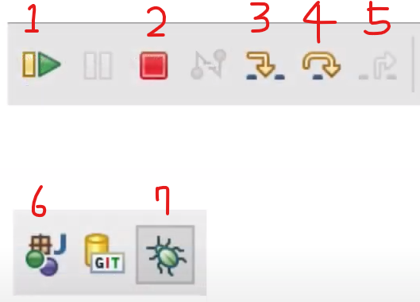
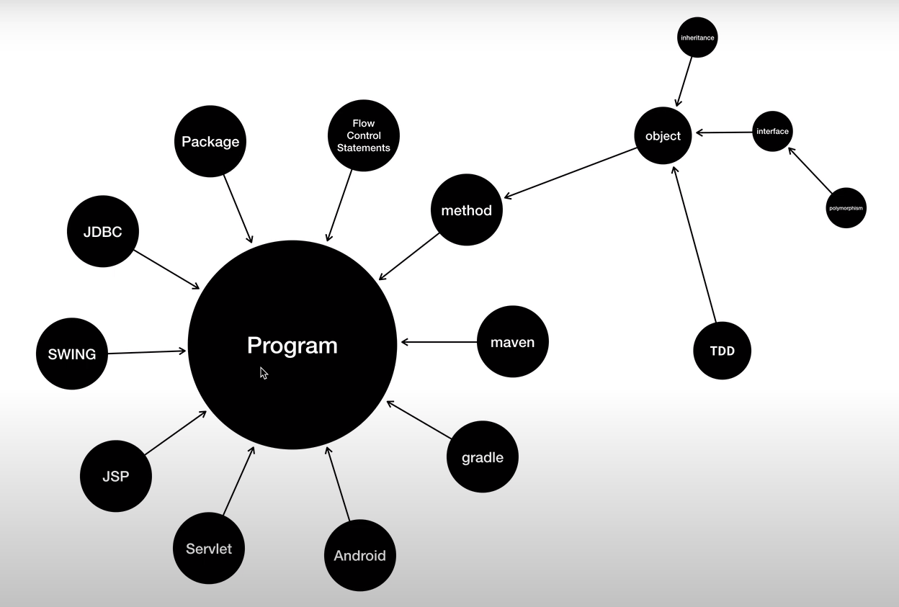

## JAVA1

- 6.2 데이터타입
    - 데이터 타입별로 연산도 분류됨

    ```java
    public class Datatype{
    	public static void main(String[] args) {
    		System.out.println(6); // Number -> 숫자
    		System.out.println("six"); // String -> 문자열
    		
    		System.out.println("6"); // String 6 -> 6이라는 문자열
    		
    		System.out.println(6+6); // 12 -> 6+6
    		System.out.println("6"+"6"); // 66 -> 6이라는 문자열 + 6이라는 문자열
    		
    		System.out.println(6*6); // 36 -> 6*6
                    //System.out.println("6"*"6"); -> 문자열을 곱한다? 에러.
    		
    		System.out.println("1111".length()); // 4 -> 문자열의 길이 : 4
                    //System.out.println(1111.length()); -> 숫자의 길이를 알려주는 코드는 없음.
    	}
    }
    ```

- 6.3 숫자와 연산
    - Math. 을 띄우면 여러 수학적 리스트가 나옴
    - Math.floor(Math.PI) → Math.PI의 소수점을 날린 값
    - Math.ceil(Math.PI) → Math.PI 에서 올림한 값

    ```java
    public class Number {
    
    	public static void main(String[] args) {
    		// Operator -> 연산자 (ex. + , - , * , /)
    		System.out.println(6 + 2); // 8
    		System.out.println(6 - 2); // 4
    		System.out.println(6 * 2); // 12
    		System.out.println(6 / 2); // 3
    		
    		System.out.println(Math.PI); // 3.141592653589793
    		System.out.println(Math.floor(Math.PI)); // 3.0
    		System.out.println(Math.ceil(Math.PI)); // 4.0
    	}
    
    }
    ```

- 6.4 문자열의 표현
    - “” 안의 내용은 문자열 (String)
    - ‘’ 안의 내용은 문자 (Character) → 한 글자만 인식 가능
    - 줄바꿈 → “Hello \nWorld” 이렇게 입력하면 Hello

    World 이렇게 나옴.

    - \”\” 안의 내용은 문자열로 실행됨 → “Hello” 는 Hello 로 , \”Hello\”는 “Hello”로 실행됨.

    ```java
    public class StringApp {
    
    	public static void main(String[] args) {
    		
    		System.out.println("Hello World"); // String
    		System.out.println('H'); // Character
    		System.out.println("H");
    		
    		System.out.println("Hello "
    				+ "World");
    		
    		// new line
    		System.out.println("Hello \nWorld");
    		
    		// escape
    		System.out.println("Hello \"World\"");// Hello "World"
    	}
    
    }
    ```

- 6.5 문자열 다루기
    - “”.length() 는 “”안의 글자수를 나타내줌
    - “”.replace(””,””) 특정 “”안의 내용을 “”로 바꾸기

    ```java
    public class StringOperation {
    
    	public static void main(String[] args) {
    		
    		System.out.println("Hello World".length()); // 11
    		System.out.println("Hello, [[[name]]] ... bye. ".replace("[[[name]]]", "duru"));
    
    	}
    
    }
    ```

- 8.1 변수의 정의
    - int a = 1; → int는 정수만 변수로 나타냄 (ex. -1, 0 ,-2, 2, 3 …)
    - double b = 1.1; → double은 실수를 변수로 나타냄.
    - String c = “Hello World”; → String은 문자를 나타냄.

    ```java
    public class Variable {
    
    	public static void main(String[] args) {
    		
    		int a = 1; // Number -> integer ... -2, -1 , 0 ,1 ...
    		System.out.println(a);
    		
    		double b = 1.1; // real number -> double ... -2.0, -1.0, 0, 1.0, 2.0 ...
    		System.out.println(b);
    		
    		String c = "Hello World";
    		System.out.println(c);
    	}
    
    }
    ```

- 8.2 변수의 효용
    - String name = “hyun”; 변수지정 하고, name을 쓸 때는 “+name+” 이렇게 사용

    ```java
    public class Letter {
    
    	public static void main(String[] args) {
    		String name = "leezche";
    		System.out.println("Hello, "+name+" ... "+name+" ... egoing ... bye");
    		
    		double VAT = 10.0;
    		System.out.println(VAT);
    	}
    
    }
    ```

- 8.3 데이터 타입의 변환 (casting)
    - double b = 1; 정수 1을 double 변수에 넣어도 실수로 나타냄 → 1.0
    - int e = (int) 1.1; 1.1을 정수로 나타내고 싶다면 앞에 (int)를 넣는다. 값은 1이고, 손실이 남
    - 1을 문자로 나타내고 싶다면 , String f = Integer.toString(1); 이렇게 넣으면 됨.

    ```java
    public class Casting {
    
    	public static void main(String[] args) {
    		
    		double a = 1.1;
    		double b = 1;
    		double b2 = (double) 1;
    		
    		System.out.println(b);
    		
    //		int c = 1.1;
    		double d = 1.1;
    		int e = (int) 1.1;
    		System.out.println(e);
    		
    		// 1 to String
    		String f = Integer.toString(1);
    		System.out.println(f.getClass());
    
    	}
    
    }
    ```

- 9.3 IOT 프로그램 만들기
    - 라이브러리를 사용할 때, 그 라이브러리의 위치/명칭을 먼저 적어줘야함

  → import org.opentutorials.iot.Elevator; → org안에 opentutorials안에 iot안에 Elevator를 사용한다는 뜻.

    - String id = “asd” → “asd” 를 넣어야 하는 곳에 id를 넣어도 값은 똑같아짐.

    ```java
    import org.opentutorials.iot.Elevator;
    import org.opentutorials.iot.Lighting;
    import org.opentutorials.iot.Security;
    
    public class OKJavaGoInHome {
    
    	public static void main(String[] args) {
    		
    		String id = "JAVA APT 507";
    		
    		// Elevator call
    		Elevator myElevator = new Elevator(id);
    		myElevator.callForUp(1);
    		
    		// Security off
    		Security mySecurity = new Security(id);
    		mySecurity.off();
    		
    		// Light on
    		Lighting hallLamp = new Lighting(id+" / Hall Lamp");
    		hallLamp.on();
    		
    		Lighting floorLamp = new Lighting(id+" / floorLamp");
    		floorLamp.on();
    
    	}
    
    }
    ```

- 10 디버거
    - 화면에서 해당 코드가 있는 줄 숫자 왼쪽을 더블클릭하면 브레이크 포인터를 만들면서 멈춤.

  

    1. 다음 브레이크 포인터가 있는 곳까지 디버깅 실행.
    2. 디버깅 정지 혹은 끝
    3. 지금 멈춰있는 코드 속으로 들어감 (더 자세히 보기)
    4. 다음 줄 코드 디버깅 실행
    5. 3번 진행했던 화면에서 다시 돌아옴.
- 11.1 입력과 출력
    - `String path = JOptionPane.showInputDialog("Enter a path");`

  → 실행하면 , Enter a path라는 문구와 함께 팝업창이 뜬다. 그 곳에 어떤 값을 넣어주면, 그 값은 문자열(String) path(변수) 의 값이 된다.

    - `double value = Double.parseDouble(text);`

  → 실행하면, text 안의 문자열이 , 실수(double)형태로 나타낼 수 있게 된다.

    ```java
    import javax.swing.JOptionPane;
    
    import org.opentutorials.iot.DimmingLights;
    import org.opentutorials.iot.Elevator;
    import org.opentutorials.iot.Lighting;
    import org.opentutorials.iot.Security;
    
    public class OKJavaGoInHomeInput {
    
    	public static void main(String[] args) {
    		
    		String id = JOptionPane.showInputDialog("Enter a ID");
    		String bright = JOptionPane.showInputDialog("Enter a Bright level");
    		
    		// Elevator call
    		Elevator myElevator = new Elevator(id);
    		myElevator.callForUp(1);
    		
    		// Security off
    		Security mySecurity = new Security(id);
    		mySecurity.off();
    		
    		// Light on
    		Lighting hallLamp = new Lighting(id+" / Hall Lamp");
    		hallLamp.on();
    		
    		Lighting floorLamp = new Lighting(id+" / floorLamp");
    		floorLamp.on();
    		
    		DimmingLights moodLamp = new DimmingLights(id+" moodLamp");
    		moodLamp.setBright(Double.parseDouble(bright));
    		moodLamp.on();
    
    	}
    
    }
    ```

- 11.2 입력과 출력 arguments & parameter
    - 실행 버튼 속 화살표를 누르고 , run configurations를 누르고, Java Application 속 해당 클래스를 들어가서, Main이 아닌 Arguments(인자)를 누르면, 입력값을 설정하고 이름도 그에맞는 설정의 이름을 설정할 수 있다.

  → ‘’속에 값을 넣어서 설정한다. Hello World를 설정한다면 Hello와 World가 설정될 뿐이다.

  그리고 여러개를 설정할 수 있다. ‘Hello World’ ‘hi’ 이렇게 설정하면 두 개의 값이 설정된다.

  → 그리고 Java Application에서 파일을 복사하여 두 개의 파일로 만들 수 있다. 값을 여러 개로 설정하고 원하는 값을 실행시키고 싶을 때 사용된다. 다른 값으로 설정 후 원하는 값이 담긴 파일을 ‘Run’ 시킨다.

    - Arguments를 설정했다면 , public static void main(String[] args) 에서 args에 설정 값이 들어가게 된다. 그래서 String id = args[0]; 은 설정한 arguments에서 첫번째 값을 입력하게 된다.

    ```java
    import javax.swing.JOptionPane;
    
    import org.opentutorials.iot.DimmingLights;
    import org.opentutorials.iot.Elevator;
    import org.opentutorials.iot.Lighting;
    import org.opentutorials.iot.Security;
    
    public class OKJavaGoInHomeInput {
    	
    	// parameter , 매개변수
    	public static void main(String[] args) {
    		
    		String id = args[0];
    		String bright = args[1];
    		
    		// Elevator call
    		Elevator myElevator = new Elevator(id);
    		myElevator.callForUp(1);
    		
    		// Security off
    		Security mySecurity = new Security(id);
    		mySecurity.off();
    		
    		// Light on
    		Lighting hallLamp = new Lighting(id+" / Hall Lamp");
    		hallLamp.on();
    		
    		Lighting floorLamp = new Lighting(id+" / floorLamp");
    		floorLamp.on();
    		
    		DimmingLights moodLamp = new DimmingLights(id+" moodLamp");
    		moodLamp.setBright(Double.parseDouble(bright));
    		moodLamp.on();
    
    	}
    
    }
    ```

- 13.2 자바 문서 보는 법 - 패키지,클래스,변수,메소드
    - ‘variable(변수),method(방법)’ 은 ‘Class’에, ‘Class’들의 그룹이 ‘Package’
- 13.3 자바 문서 보는 법 - 클래스
    - 클래스란, 서로 연관된 변수와 메소드들을 모아서 이름을 붙여놓은 것

    ```java
    public class ClassApp {
    
    	public static void main(String[] args) {
    		
    		System.out.println(Math.PI); // 3.141592653589793
    		System.out.println(Math.floor(1.6)); // 1.0
    		System.out.println(Math.ceil(1.6)); // 2.0
    		
    
    	}
    
    }
    ```

- 13.4 자바 문서 보는 법 - 인스턴스
    - 클래스에 Constructer가 있다면 그건 인스턴스다…

    ```java
    import java.io.FileNotFoundException;
    import java.io.IOException;
    import java.io.PrintWriter;
    public class InstanceApp {
    
    	public static void main(String[] args) throws IOException {
    		
    		PrintWriter p1 = new PrintWriter("result1.txt");
    		p1.write("Hello 1");
    		p1.close();
    		
    		
    		PrintWriter p2 = new PrintWriter("result2.txt");
    		p2.write("Hello 2");
    		p2.close();
    		
    	}
    
    }
    ```

- 13.5 자바 문서 보는 법 - 상속
    - java.lang.Object → java.io.Writer → java.io.PrintWriter 순으로 상속받음. (부모자식)

  → 같은 write(String)이 있다는 건 상속받은 Class가 덮어쓰기했다는것. 부모Class에서 만든 write(String)과는 다른 용도로 쓰려고 덮어쓴 것.

  → 현재 코드에서 쓰이고 있는 Class의 write(String)을 사용한다.

- 14.2 나의 앱 만들기 - 기본 기능 구현
    - 상단 Edit → Find/Replace → Find에 10000.0 입력 , Replace에 12345.0 입력 후 , Replace All 을 하게되면 10000.0 은 전부 12345.0으로 바뀜.

    ```java
    public class AccountingApp {
    
    	public static void main(String[] args) {
    		
    		System.out.println("Value of supply : "+12345.0); // 공급가
    		System.out.println("VAT : "+ (12345.0*0.1) ); // 부가세
    		System.out.println("Total : "+ (12345.0 + 12345.0*0.1) ); // 합계금액
    		System.out.println("Expense : "+ (12345.0*0.3 ) ); // 비용
    		System.out.println("Income : "+ (12345.0 - 12345.0*0.3) ); // 소득
    		System.out.println("Dividend 1 : "+ (12345.0 - 12345.0*0.3) * 0.5 ); // 배당금
    		System.out.println("Dividend 2 : "+ (12345.0 - 12345.0*0.3) * 0.3 ); // 배당금
    		System.out.println("Dividend 3 : "+ (12345.0 - 12345.0*0.3) * 0.2 ); // 배당금
    		
    	}
    
    }
    ```

- 14.3 나의 앱 만들기 - 변수도입
    - 해당 입력값을 드래그 → 오른쪽 마우스 → Refactor → Extract Local Variable

  (Alt + Shift + L) → Variable name에 원하는 변수명 입력 → 같은 값의 모든 코드가 한 개의 변수로 생성됨. *Preview로 체크할 것*

    ```java
    public class AccountingApp {
    
    	public static void main(String[] args) {
    		
    		double valueOfSupply = 10000.0;
    		double vatRate = 0.1;
    		double expenseRate = 0.3;
    		double vat = valueOfSupply*vatRate;
    		double total = valueOfSupply + vat;
    		double expense = valueOfSupply*expenseRate;
    		double income = valueOfSupply - expense;
    		double dividend1 = income * 0.5;
    		double dividend2 = income * 0.3;
    		double dividend3 = income * 0.2;
    		
    		
    		System.out.println("Value of supply : "+valueOfSupply);
    		System.out.println("VAT : "+ vat );
    		System.out.println("Total : "+ total );
    		System.out.println("Expense : "+ expense );
    		System.out.println("Income : "+ income );
    		System.out.println("Dividend 1 : "+ dividend1 );
    		System.out.println("Dividend 2 : "+ dividend2 );
    		System.out.println("Dividend 3 : "+ dividend3 );
    		
    		
    		
    	}
    
    }
    ```

- 14.4 나의 앱 만들기 - 입력값 도입
    - double valueOfSupply = Double.parseDouble(args[0]);

  → double(실수형)으로 변수를 지정했지만, args는 string으로 지정되어있음.

  → args의 문자형을 실수형으로 출력하는 코드.

    ```java
    public class AccountingApp {
    
    	public static void main(String[] args) {
    		
    		double valueOfSupply = Double.parseDouble(args[0]);
    		double vatRate = 0.1;
    		double expenseRate = 0.3;
    		double vat = valueOfSupply*vatRate;
    		double total = valueOfSupply + vat;
    		double expense = valueOfSupply*expenseRate;
    		double income = valueOfSupply - expense;
    		double dividend1 = income * 0.5;
    		double dividend2 = income * 0.3;
    		double dividend3 = income * 0.2;
    		
    		
    		System.out.println("Value of supply : "+valueOfSupply);
    		System.out.println("VAT : "+ vat );
    		System.out.println("Total : "+ total );
    		System.out.println("Expense : "+ expense );
    		System.out.println("Income : "+ income );
    		System.out.println("Dividend 1 : "+ dividend1 );
    		System.out.println("Dividend 2 : "+ dividend2 );
    		System.out.println("Dividend 3 : "+ dividend3 );
    		
    		
    		
    	}
    
    }
    ```

- 14.5 나의 앱 만들기 - 오리엔테이션2

  

- 14.6 나의 앱 만들기 - 조건문 ( if )

    ```java
    public class AccountingIFApp {
    
    	public static void main(String[] args) {
    		
    		double valueOfSupply = Double.parseDouble(args[0]);
    		double vatRate = 0.1;
    		double expenseRate = 0.3;
    		double vat = valueOfSupply*vatRate;
    		double total = valueOfSupply + vat;
    		double expense = valueOfSupply*expenseRate;
    		double income = valueOfSupply - expense;
    		
    		double dividend1;
    		double dividend2;
    		double dividend3;
    		
    		
    		if(income > 10000.0) {
    			dividend1 = income * 0.5;
    			dividend2 = income * 0.3;
    			dividend3 = income * 0.2;
    		} else {
    			dividend1 = income * 1.0;
    			dividend2 = income * 0;
    			dividend3 = income * 0;
    		}
    		
    		
    		System.out.println("Value of supply : "+valueOfSupply);
    		System.out.println("VAT : "+ vat );
    		System.out.println("Total : "+ total );
    		System.out.println("Expense : "+ expense );
    		System.out.println("Income : "+ income );
    		System.out.println("Dividend 1 : "+ dividend1 );
    		System.out.println("Dividend 2 : "+ dividend2 );
    		System.out.println("Dividend 3 : "+ dividend3 );
    		
    		
    		
    	}
    
    }
    ```

- 14.7 나의 앱 만들기 - 배열 ( [ ] )
    - dividendRates 하나의 변수로 3개의 변수를 만들어 냄. (배열을 이용하여)

    ```java
    double[] dividendRates = new double[3];
    		dividendRates[0] = 0.5;
    		dividendRates[2] = 0.3;
    		dividendRates[1] = 0.2;
    ```

    ```java
    public class AccountingArrayApp {
    
    	public static void main(String[] args) {
    		
    		double valueOfSupply = Double.parseDouble(args[0]);
    		double vatRate = 0.1;
    		double expenseRate = 0.3;
    		double vat = valueOfSupply*vatRate;
    		double total = valueOfSupply + vat;
    		double expense = valueOfSupply*expenseRate;
    		double income = valueOfSupply - expense;
    		
    		double[] dividendRates = new double[3];
    		dividendRates[0] = 0.5;
    		dividendRates[2] = 0.3;
    		dividendRates[1] = 0.2;
    		
    		double dividend1 = income * dividendRates[0];
    		double dividend2 = income * dividendRates[1];
    		double dividend3 = income * dividendRates[2];
    		
    		
    		System.out.println("Value of supply : "+valueOfSupply);
    		System.out.println("VAT : "+ vat );
    		System.out.println("Total : "+ total );
    		System.out.println("Expense : "+ expense );
    		System.out.println("Income : "+ income );
    		System.out.println("Dividend 1 : "+ dividend1 );
    		System.out.println("Dividend 2 : "+ dividend2 );
    		System.out.println("Dividend 3 : "+ dividend3 );
    		
    		
    		
    	}
    
    }
    ```

- 14.8 나의 앱 만들기 - 반복문 ( while )

    ```java
    public class AccountingArrayLoopApp {
    
    	public static void main(String[] args) {
    		
    		double valueOfSupply = Double.parseDouble(args[0]);
    		double vatRate = 0.1;
    		double expenseRate = 0.3;
    		double vat = valueOfSupply*vatRate;
    		double total = valueOfSupply + vat;
    		double expense = valueOfSupply*expenseRate;
    		double income = valueOfSupply - expense;
    		
    		
    		
    		System.out.println("Value of supply : "+valueOfSupply);
    		System.out.println("VAT : "+ vat );
    		System.out.println("Total : "+ total );
    		System.out.println("Expense : "+ expense );
    		System.out.println("Income : "+ income );
    		
    		double[] dividendRates = new double[3];
    		dividendRates[0] = 0.5;
    		dividendRates[1] = 0.3;
    		dividendRates[2] = 0.2;
    		
    		
    		int i = 0;
    		while(i < dividendRates.length) {
    			System.out.println("Dividend : "+ (income*dividendRates[i]) );
    			i = i + 1;
    		}
    		
    		
    		
    	}
    
    }
    ```

- 14.9 나의 앱 만들기 - 메소드
    - 메소드는 서로 연관된 코드를 그루핑해서 이름을 붙인 정리정돈의 상자다.
    - 해당 코드를 드래그 → Refactor → Extract Method (Alt + Shift + M) → 메소드 이름을 입력 → 메소드 생성
    - 전역변수로 바꿔주는 방법 : 바꾸고 싶은 코드 드래그 → Refactor → Convert Local Variable to Field → Field name지정, public클릭 → 완료

    ```java
    public class AccountingMethodApp {
    	public static double valueOfSupply;
    	public static double vatRate;
    	public static double expenseRate;
    
    	public static void main(String[] args) {
    		
    		valueOfSupply = 10000.0;
    		vatRate = 0.1;
    		expenseRate = 0.3;
    		print();
    	}
    // 여기부터 메인을 벗어난 메소드
    
    	public static void print() {
    		System.out.println("Value of supply : "+valueOfSupply);
    		System.out.println("VAT : "+ getVAT() );
    		System.out.println("Total : "+ getTotal() );
    		System.out.println("Expense : "+ getExpense() );
    		System.out.println("Income : "+ getIncome() );
    		System.out.println("Dividend 1 : "+ getDividend1() );
    		System.out.println("Dividend 2 : "+ getDividend2() );
    		System.out.println("Dividend 3 : "+ getDividend3() );
    	}
    
    	public static double getDividend1() {
    		return getIncome() * 0.5;
    	}
    	
    	public static double getDividend2() {
    		return getIncome() * 0.3;
    	}
    	
    	public static double getDividend3() {
    		return getIncome() * 0.2;
    	}
    
    	public static double getIncome() {
    		return valueOfSupply - getExpense();
    	}
    
    	public static double getExpense() {
    		return valueOfSupply*expenseRate;
    	}
    
    	public static double getTotal() {
    		return valueOfSupply + getVAT();
    	}
    
    	public static double getVAT() {
    		return valueOfSupply*vatRate;
    	}
    
    }
    ```

- 14.10 나의 앱 만들기 - 클래스
    - 객체(클래스)는 서로 연관된 변수와 메소드를 그루핑하고, 이름을 붙인 정리정돈의 상자이다.
    - Accounting이라는 클래스를 만들어서 그 안에 넣고, 메인에 있는 메소드 앞에 해당하는 클래스 이름을 .과함께 붙여준다. (ex. Accounting.vatRate = 0.1;)

    ```java
    class Accounting{
    	public static double valueOfSupply;
    	public static double vatRate;
    	public static double expenseRate;
    	
    	public static void print() {
    		System.out.println("Value of supply : "+valueOfSupply);
    		System.out.println("VAT : "+ getVAT() );
    		System.out.println("Total : "+ getTotal() );
    		System.out.println("Expense : "+ getExpense() );
    		System.out.println("Income : "+ getIncome() );
    		System.out.println("Dividend 1 : "+ getDividend1() );
    		System.out.println("Dividend 2 : "+ getDividend2() );
    		System.out.println("Dividend 3 : "+ getDividend3() );
    	}
    
    	public static double getDividend1() {
    		return getIncome() * 0.5;
    	}
    	
    	public static double getDividend2() {
    		return getIncome() * 0.3;
    	}
    	
    	public static double getDividend3() {
    		return getIncome() * 0.2;
    	}
    
    	public static double getIncome() {
    		return valueOfSupply - getExpense();
    	}
    
    	public static double getExpense() {
    		return valueOfSupply*expenseRate;
    	}
    
    	public static double getTotal() {
    		return valueOfSupply + getVAT();
    	}
    
    	public static double getVAT() {
    		return valueOfSupply*vatRate;
    	}
    }
    public class AccountingClassApp {
    	
    
    	public static void main(String[] args) {
    		
    		Accounting.valueOfSupply = 10000.0;
    		Accounting.vatRate = 0.1;
    		Accounting.expenseRate = 0.3;
    		Accounting.print();
    		// anotherVariable = ...;
    		// anotherMethod = ...;
    	}
    
    	
    
    }
    ```

- 14.11 나의 앱 만들기 - 인스턴스
  - 인스턴스는 하나의 클래스를 복제해서 서로 다른 데이터의 값과 서로 같은 메소드를 가진 복제본을 만드는 것
  - new Accounting = Accounting 클래스를 복제함.
  - instance를 사용하려면 static은 사용하면 안됨.

    ```java
    class Accounting{
    	public double valueOfSupply;
    	public double vatRate;
    	public double expenseRate;
    	
    	public void print() {
    		System.out.println("Value of supply : "+valueOfSupply);
    		System.out.println("VAT : "+ getVAT() );
    		System.out.println("Total : "+ getTotal() );
    		System.out.println("Expense : "+ getExpense() );
    		System.out.println("Income : "+ getIncome() );
    		System.out.println("Dividend 1 : "+ getDividend1() );
    		System.out.println("Dividend 2 : "+ getDividend2() );
    		System.out.println("Dividend 3 : "+ getDividend3() );
    	}
    
    	public double getDividend1() {
    		return getIncome() * 0.5;
    	}
    	
    	public double getDividend2() {
    		return getIncome() * 0.3;
    	}
    	
    	public double getDividend3() {
    		return getIncome() * 0.2;
    	}
    
    	public double getIncome() {
    		return valueOfSupply - getExpense();
    	}
    
    	public double getExpense() {
    		return valueOfSupply*expenseRate;
    	}
    
    	public double getTotal() {
    		return valueOfSupply + getVAT();
    	}
    
    	public double getVAT() {
    		return valueOfSupply*vatRate;
    	}
    }
    
    public class AccountingClassApp {
    	
    	public static void main(String[] args) {	
    		// instance
    		Accounting a1 = new Accounting();
    		a1.valueOfSupply = 10000.0;
    		a1.vatRate = 0.1;
    		a1.expenseRate = 0.3;
    		a1.print();
    		
    		Accounting a2 = new Accounting();
    		a2.valueOfSupply = 20000.0;
    		a2.vatRate = 0.05;
    		a2.expenseRate = 0.2;
    		a2.print();
    		
    		a1.print();
    	}
    }
    ```
