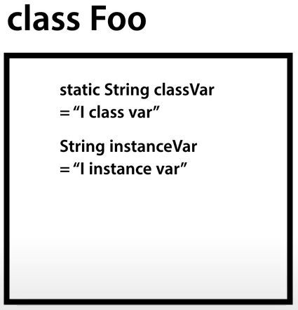
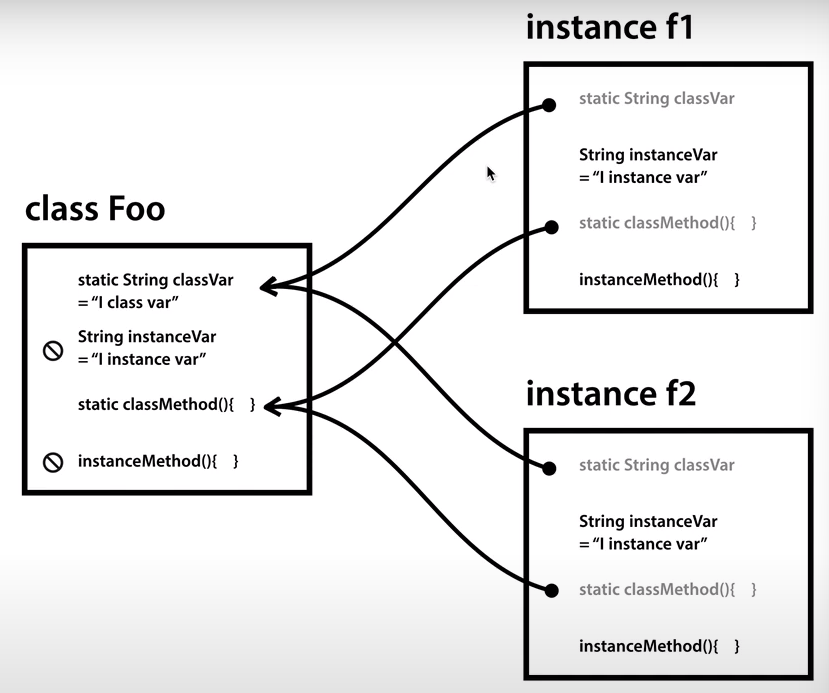

## JAVA 객체지향 프로그래밍

- 2 남의 클래스 & 남의 인스턴스

    ```java
    import java.io.FileWriter;
    import java.io.IOException;
    
    public class OthersOOP {
    
    	public static void main(String[] args) throws IOException {
    		// class : System, Math, FileWriter
    		// instance : f1, f2
    		
    		System.out.println(Math.PI);
    		System.out.println(Math.floor(1.8));
    		System.out.println(Math.ceil(1.8));
    		
    		FileWriter f1 = new FileWriter("data.txt");
    		f1.write("Hello");
    		f1.write("Java");
    		
    		
    		FileWriter f2 = new FileWriter("data2.txt");
    		f2.write("Hello");
    		f2.write("Java");
    		f2.close();
    		
    		f1.write("!!!");
    		f1.close();
    	}
    
    }
    ```

- 3 변수와 메소드

    ```java
    public class MyOOP {
    	
    	public static void main(String[] args) {
    		delimiter = "----";
    		printA();
    		printA();
    		printB();
    		printB();
    		
    		delimiter = "****";
    		printA();
    		printA();
    		printB();
    		printB();
    
    	}
    	public static String delimiter = "";
    	public static void printA() {
    		System.out.println(delimiter);
    		System.out.println("A");
    		System.out.println("A");
    	}
    	public static void printB() {
    		System.out.println(delimiter);
    		System.out.println("B");
    		System.out.println("B");
    	}
    	//..
    	
    }
    ```

- 4.1 클래스 - 존재 이유와 기본형식

    ```java
    class Print{
    	public static String delimiter = "";
    	public static void A() {
    		System.out.println(delimiter);
    		System.out.println("A");
    		System.out.println("A");
    	}
    	public static void B() {
    		System.out.println(delimiter);
    		System.out.println("B");
    		System.out.println("B");
    	}
    }
    public class MyOOP {
    	public static void main(String[] args) {
    		Print.delimiter = "----";
    		Print.A();
    		Print.A();
    		Print.B();
    		Print.B();
    		
    		Print.delimiter = "****";
    		Print.A();
    		Print.A();
    		Print.B();
    		Print.B();
    
    	}
    }
    ```

- 4.2 클래스 - 형식
    - 클래스는 쪼개서 파일로 따로 관리가 가능

    ```java
    class Print {
    	public static String delimiter = "";
    	public static void A() {
    		System.out.println(delimiter);
    		System.out.println("A");
    		System.out.println("A");
    	}
    	public static void B() {
    		System.out.println(delimiter);
    		System.out.println("B");
    		System.out.println("B");
    	}
    }
    ```

    ```java
    public class MyOOP {
    	public static void main(String[] args) {
    		Print.delimiter = "----";
    		Print.A();
    		Print.A();
    		Print.B();
    		Print.B();
    		
    		Print.delimiter = "****";
    		Print.A();
    		Print.A();
    		Print.B();
    		Print.B();
    
    	}
    }
    ```

- 5 인스턴스
    - Print라는 클래스를 복제해서 instance를 만든다.
    - p1이라는 instance로 코드를 간결하게 만든다.

    ```java
    public class MyOOP {
    	public static void main(String[] args) {
    		Print p1 = new Print();
    		p1.delimiter = "----";
    		p1.A();
    		p1.A();
    		p1.B();
    		p1.B();
    		
    		Print p2 = new Print();
    		p2.delimiter = "****";
    		p2.A();
    		p2.A();
    		p2.B();
    		p2.B();
    		
    		p1.A();
    		p2.A();
    		p1.A();
    		p2.A();
    	}
    }
    ```

    ```java
    class Print {
    	public String delimiter = "";
    	
    	public void A() {
    		System.out.println(delimiter);
    		System.out.println("A");
    		System.out.println("A");
    	}
    	
    	public void B() {
    		System.out.println(delimiter);
    		System.out.println("B");
    		System.out.println("B");
    	}
    }
    ```

- 6 static


  

내가 이해한 바로는.. class를 복제한 게 instance이다. f1이라는 instance를 바꾼다 한들, Foo라는 class를 기반으로 만든 복제품이기 때문에 f2가 바뀐 값이 되지는 않는다.

  ⇒ classVar의 내용을 바꿔버리면, f2도 바뀐다.

  ⇒ 그러나, instanceVar를 바꾼다고 해도, f2는 바뀌지 않는다.

  → class 속 내용을 바꾼다면, 그 class를 기반으로 복제한 instance는 당연히 바뀐다.

  → class를 기반으로 만든 instance는, instance 하나를 바꾼다고 해도, 다른 instance가 바뀌지 않는다.

  

```java
    class Foo{
    	public static String classVar = "I class var";
    	public String instanceVar = "I instance var";
    	public static void classMethod() {
    		System.out.println(classVar); // OK
    //		System.out.println(instanceVar); // Error
    	}
    	public void instanceMethod() {
    		System.out.println(classVar); // OK
    		System.out.println(instanceVar); // OK
    	}
    }
    public class StaticApp {
    
    	public static void main(String[] args) {
    		System.out.println(Foo.classVar); // OK
    //		System.out.println(Foo.instanceVar); // Error
    		Foo.classMethod();
    //		Foo.instanceMethod();
    		
    		Foo f1 = new Foo();
    		Foo f2 = new Foo();
    		
    		System.out.println(f1.classVar); // I class var
    		System.out.println(f1.instanceVar); // I instance var
    		
    		f1.classVar = "changed by f1";
    		System.out.println(Foo.classVar); // changed by f1
    		System.out.println(f2.classVar); // changed by f1
    		
    		f1.instanceVar = "changed by f1";
    		System.out.println(f1.instanceVar); // changed by f1
    		System.out.println(f2.instanceVar); // I instance var
    	}
    
    }
   ```
- 7 생성자와 this
    - class의 이름과 같은 메소드를 만들면 생성자.. 스태틱이나 리턴데이터타입은 지정x
    - 생성자는 초기에 주입할 필요가 있는 값을 전달하거나, 또는 초기에 작업을 수행하도록 할 때 쓴다.
    - this라고 하는 특수한 키워드는 그 클래스가 인스턴스화 되었을 때의 인스턴스를 가르키는 특수한 이름이다.

    ```java
    public class MyOOP {
    	public static void main(String[] args) {
    		Print p1 = new Print("----");
    		p1.A();
    		p1.A();
    		p1.B();
    		p1.B();
    		
    		Print p2 = new Print("****");
    		p2.A();
    		p2.A();
    		p2.B();
    		p2.B();
    		
    		p1.A();
    		p2.A();
    		p1.A();
    		p2.A();
    	}
    }
    ```

    ```java
    class Print {
    	public String delimiter = "";
    	public Print(String delimiter) {
    		this.delimiter = delimiter;
    	}
    	public void A() {
    		System.out.println(this.delimiter);
    		System.out.println("A");
    		System.out.println("A");
    	}
    	
    	public void B() {
    		System.out.println(this.delimiter);
    		System.out.println("B");
    		System.out.println("B");
    	}
    }
    ```

- 8.1 활용 - 클래스화
    - Accounting이라는 클래스를 만듦으로써 코드를 더 깔끔하게 정리할 수 있었고,

  getTotal()이라는 흔한 메소드를 Accounting.으로 쉽고 명확하게 구분지을 수 있었다.

    ```java
    class Accounting{
    	public static double valueOfSupply;
    	public static double vatRate = 0.1;
    	public static double getVAT() {
    		return valueOfSupply * vatRate;
    	}
    	public static double getTotal() {
    		return valueOfSupply + getVAT();
    	}
    }
    public class AccountingApp {
    	public static void main(String[] args) {
    		Accounting.valueOfSupply = 10000.0;
    		System.out.println("Value of supply : "+Accounting.valueOfSupply);
    		System.out.println("VAT : "+ Accounting.getVAT());
    		System.out.println("Total : "+ Accounting.getTotal());
    		
    	}
    }
    ```

- 8.2 활용 - 인스턴스화

    ```java
    class Accounting{
    	public double valueOfSupply;
    	public static double vatRate = 0.1;
    	public Accounting(double valueOfSupply) {
    		this.valueOfSupply = valueOfSupply;
    	}
    	public double getVAT() {
    		return valueOfSupply * vatRate;
    	}
    	public double getTotal() {
    		return valueOfSupply + getVAT();
    	}
    }
    public class AccountingApp {
    	public static void main(String[] args) {
    		Accounting a1 = new Accounting(10000.0);
    		
    		Accounting a2 = new Accounting(20000.0);
    		
    		System.out.println("value of supply : " + a1.valueOfSupply);
    		System.out.println("value of supply : " + a2.valueOfSupply);
    		
    		System.out.println("VAT : " + a1.getVAT());
    		System.out.println("VAT : " + a2.getVAT());
    		
    		System.out.println("Total : " + a1.getTotal());
    		System.out.println("Total : " + a2.getTotal());
    		
    	}
    }
    ```